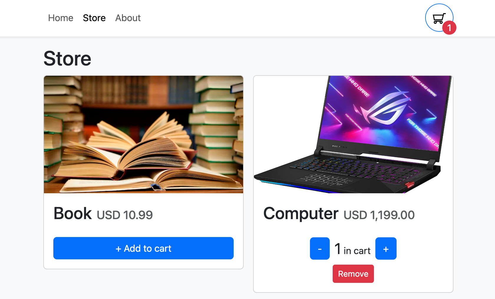
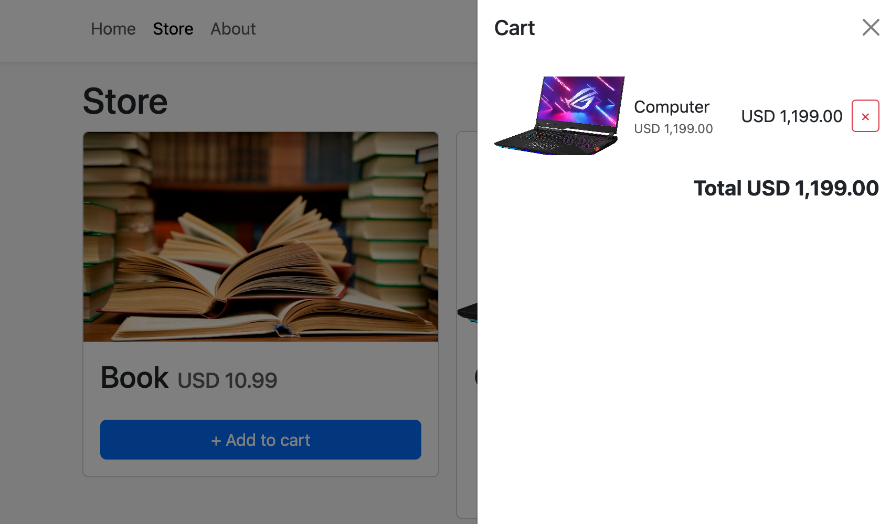
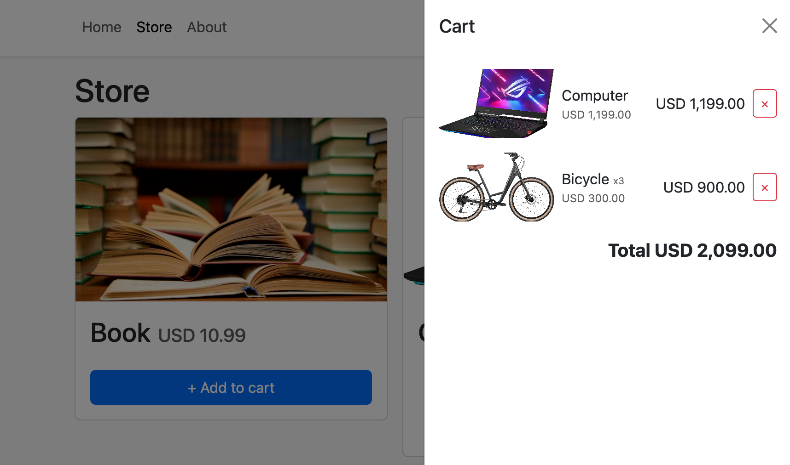

# Shopping Cart
The idea of this basic React project is to demonstrate how a shopping cart works in a real life project in which we are able to add items into the cart using React context and hooks, updating the current state of the application.

The web application was created with **Vite** and has the following dependencies:
1. react v18.2
2. bootstrap v5.2
3. react-bootstrap v2.10
4. react-router-dom v6.22
5. typescript v5.2

